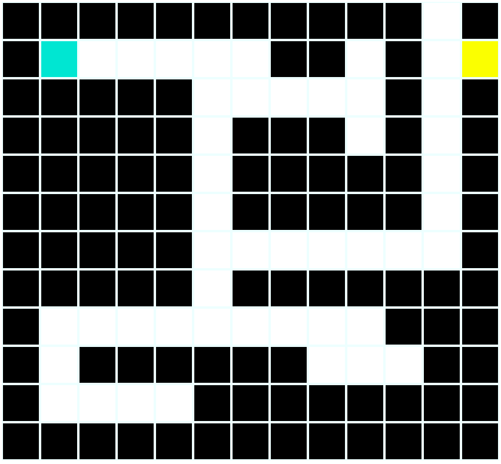

# Amazeing

The goal of this exercise is to create a labyrinth with a starting point where the player is and an ending point where the treasure is. The movement is done with the directional arrows.

